# VISUAL ARCHITECTURE ATLAS
## Document 15 of 17 — All 20 Mermaid Diagrams
**Generated:** 2026-06-16 | **Baseline Commit:** f77a36d (CERTIFIED)

---

## DIAGRAM 1: HIGH-LEVEL SYSTEM ARCHITECTURE

**Description:** Top-level view of APEX AI OS components and their relationships.

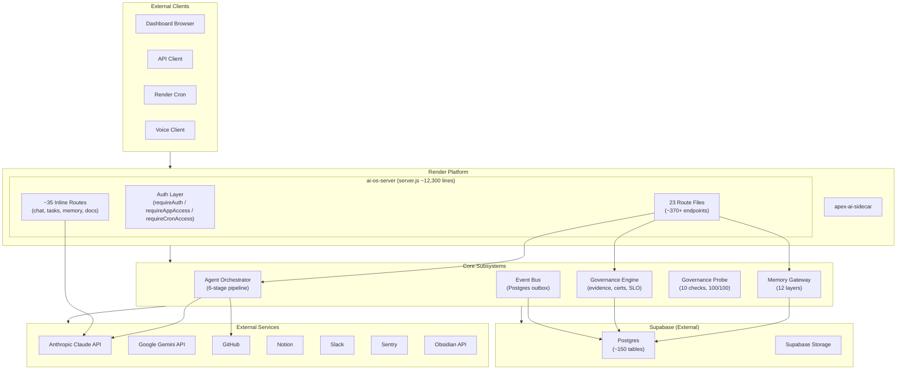

---

## DIAGRAM 2: STARTUP SEQUENCE

**Description:** Sequence of operations during server.js initialization.

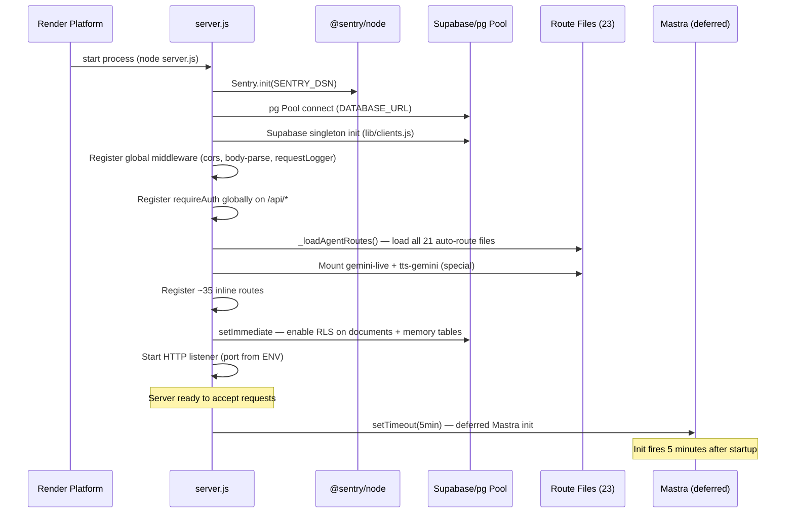

---

## DIAGRAM 3: REQUEST LIFECYCLE

**Description:** Full lifecycle of an authenticated API request.

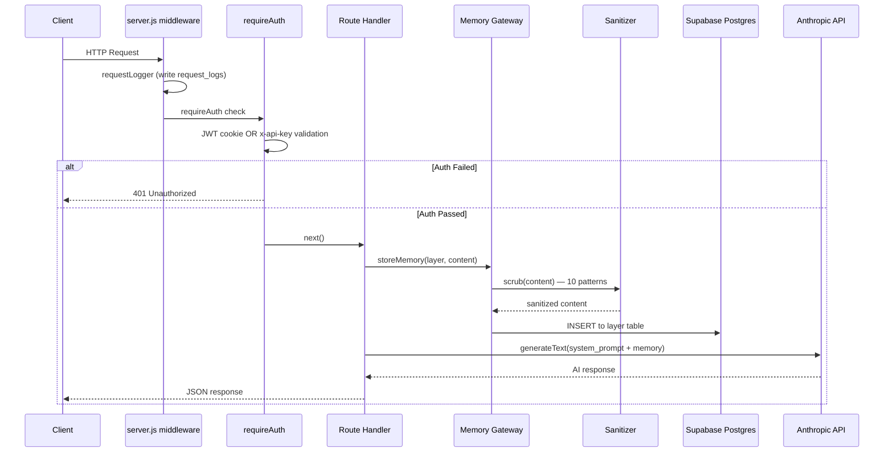

---

## DIAGRAM 4: AGENT EXECUTION LIFECYCLE

**Description:** 6-stage pipeline with 5 pre-execution gates.

```mermaid
flowchart TD
    START(["Task Submitted"]) --> G1

    subgraph GATES["Pre-Execution Gates"]
        G1{"GATE 1\nConstitutional\nCheck anti-goals"} -->|FAIL| BLOCK1(["BLOCKED\nAnti-goal violation"])
        G1 -->|PASS| G2
        G2{"GATE 2\nAutonomy\nLEVEL_0?"} -->|LEVEL_0| BLOCK2(["BLOCKED\nAutonomy level 0"])
        G2 -->|PASS| G3
        G3{"GATE 3\nTwin Gate\ndo_not_deploy?"} -->|YES| BLOCK3(["BLOCKED\nTwin simulation"])
        G3 -->|PASS| G4
        G4{"GATE 4\nDeploy Gate\npolicy=hold?"} -->|HOLD| BLOCK4(["BLOCKED\nDeploy hold"])
        G4 -->|PASS| G5
        G5{"GATE 5\nBehavior Gate\nblocking constraint?"} -->|YES| BLOCK5(["BLOCKED\nBehavior constraint"])
        G5 -->|PASS| PIPELINE
    end

    subgraph PIPELINE["6-Stage Pipeline"]
        S1["STAGE 1\nRESEARCHER\n(Optional — Firecrawl/Playwright)"]
        S2["STAGE 2\nARCHITECT\n(Zod plan validation)"]
        S3["STAGE 3\nDEVELOPER\n(per-file write, 3-retry, 8096 tokens)"]
        S4A["STAGE 4A\nREVIEWER\n(AI code review)"]
        S4B["STAGE 4B\nVALIDATOR\n(static analysis only)"]
        S5["STAGE 5\nTESTER\n(node --check per file)"]
        S6["STAGE 6\nCOMMITTER\n(git commit + push + deploy)"]

        S1 --> S2 --> S3 --> S4A
        S3 --> S4B
        S4A -->|Both must pass| S5
        S4B -->|Both must pass| S5
        S5 --> S6
    end

    PIPELINE --> S1
    S6 --> REFLECT["REFLECTOR\n(Haiku lesson extraction\n→ gateway layer 10)"]
    REFLECT --> DONE(["Pipeline Complete"])

    subgraph VALIDATOR_DETAIL["VALIDATOR Detail"]
        V1{"testCases=[] OR\nfilesApplied=[]?"} -->|YES| AUTOPASS["AUTO-PASS\n(FAIL-OPEN)"]
        V1 -->|NO| V2{"Exception/parse\nfailure?"} -->|YES| FAILCLOSED["passed=false\n(fail-closed WS-1B)"]
        V2 -->|NO| V3{"passed=false AND\nfailedCases.length>0?"} -->|YES| RETRY["Trigger retry"]
        V3 -->|passed=false, failedCases=[]| GAP["NO RETRY\n(dispatch gap — residual risk)"]
    end
```

---

## DIAGRAM 5: MEMORY ARCHITECTURE

**Description:** 12-layer memory system with gateway routing.

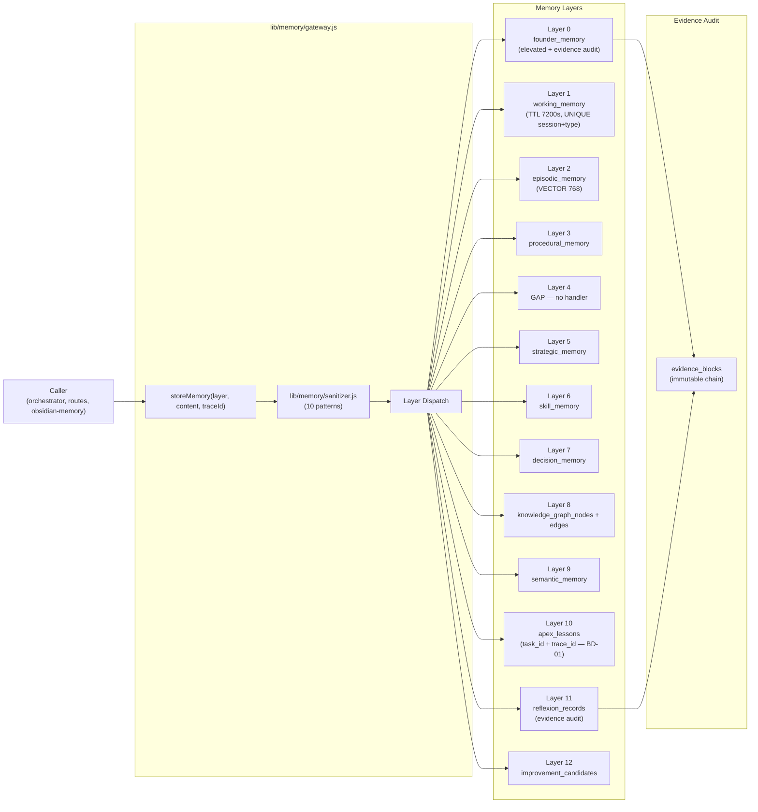

---

## DIAGRAM 6: GOVERNANCE ARCHITECTURE

**Description:** Full governance system from evidence chain to probe.

```mermaid
flowchart TD
    subgraph TRIGGERS["Write Triggers"]
        MEM_L0["Memory Layer 0 write"]
        MEM_L11["Memory Layer 11 write"]
        PIPELINE["Agent pipeline stages"]
        PROBERUN["Probe runner"]
    end

    subgraph GOVERNANCE["lib/governance*.js"]
        EV["appendEvidenceBlock()\n(immutable chain, prev_hash)"]
        SNAP["captureSnapshot()"]
        CERT["certify() — score 0-1.0\n0=denied, 1.0=certified"]
        INC["createIncident() / resolveIncident()"]
        SLO_W["recordSLOMeasurement()"]
        COST_W["recordCost()\n(tokens_in, tokens_out, cost_usd)"]
        DASH["captureDashboardSnapshot()"]
    end

    subgraph TABLES["Governance Tables"]
        EB["evidence_blocks\n(chain_id, payload, prev_hash)"]
        ES["execution_snapshots"]
        EA["execution_artifacts"]
        CA["cost_accounting"]
        CERT_T["certifications\nsystem_certifications"]
        INC_T["incidents\nincident_timelines\nincident_evidence\nincident_resolutions"]
        SLO_T["slo_definitions\nslo_measurements\nslo_violations"]
        POL_T["policies\npolicy_decisions\npolicy_violations"]
        ANO["anomalies"]
        DS["dashboard_snapshots"]
        GP["governance_probes"]
    end

    subgraph PROBE["governance-probe.js (10 checks)"]
        P1["1. execution_snapshots"]
        P2["2. cost_accounting_tokens"]
        P3["3. execution_artifacts"]
        P4["4. certification_certified"]
        P5["5. evidence_blocks"]
        P6["6. lesson_sources"]
        P7["7. lesson_traceability_bd01"]
        P8["8. incident_creation"]
        P9["9. certification_denied"]
        P10["10. incident_resolution"]
        SCORE["Score: 100/100\nprobe_passed=true"]
    end

    TRIGGERS --> GOVERNANCE
    MEM_L0 & MEM_L11 --> EV
    PIPELINE --> SNAP & EA & COST_W
    EV --> EB
    SNAP --> ES
    CERT --> CERT_T
    INC --> INC_T
    SLO_W --> SLO_T
    COST_W --> CA
    DASH --> DS
    PROBE --> GP
    P1-..->ES
    P2-..->CA
    P3-..->EA
    P4 & P9-..->CERT_T
    P5-..->EB
    P6-..->POL_T
    P7-..->apex_lessons
    P8 & P10-..->INC_T
    SCORE --> GP
```

---

## DIAGRAM 7: AUTHENTICATION ARCHITECTURE

**Description:** 3-layer auth system with boundaries.

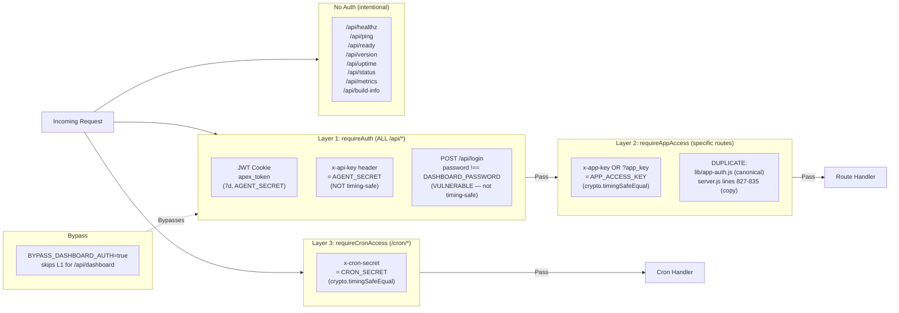

---

## DIAGRAM 8: DATABASE ARCHITECTURE

**Description:** Tables grouped by domain with migration history.

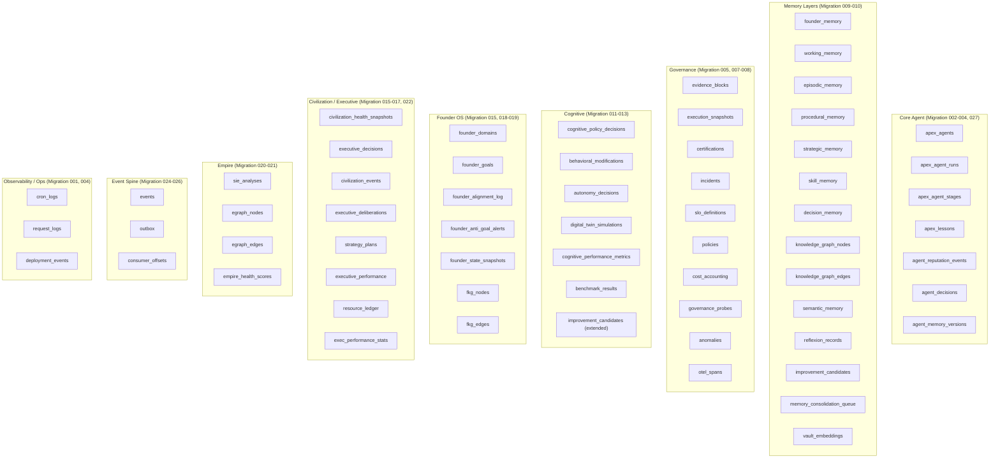

---

## DIAGRAM 9: SUPABASE INTERACTION GRAPH

**Description:** Which files write to which tables.

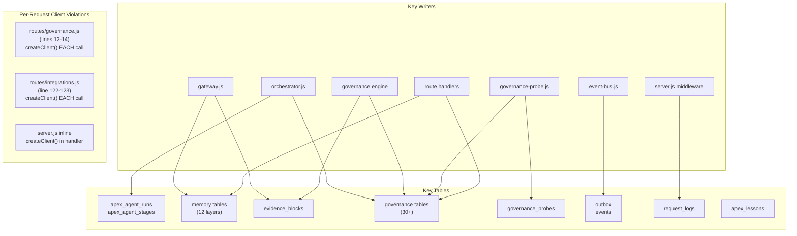

---

## DIAGRAM 10: RENDER DEPLOYMENT ARCHITECTURE

**Description:** Deployment flow from git push to live service.

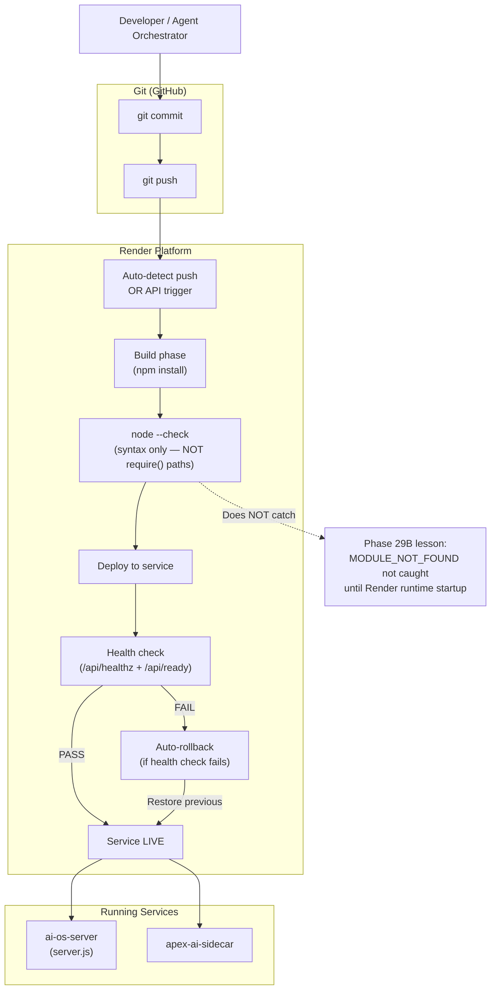

---

## DIAGRAM 11: TELEMETRY ARCHITECTURE

**Description:** All monitoring and observability flows.

```mermaid
flowchart TD
    subgraph SOURCES["Event Sources"]
        HTTP_REQ["HTTP Requests"]
        AGENT_RUN["Agent Pipeline Runs"]
        GOV_EVT["Governance Events"]
        CRON_EVT["Cron Executions"]
        VOICE_EVT["Voice Sessions"]
        DEPLOY_EVT["Deploy Events"]
    end

    subgraph COLLECTORS["Collectors"]
        SENTRY["@sentry/node\n(unhandled exceptions)"]
        REQ_LOG["requestLogger middleware\n(all HTTP)"]
        ORCH_LOG["orchestrator.js\n(pipeline audit)"]
        GOV_LOG["governance engine\n(evidence + spans)"]
        CRON_LOG["cron handlers\n(cron_logs)"]
        LAT_TRACK["lib/latency-tracker\n(voice latency)"]
        COUNTER["lib/counter.js\n(request count)"]
    end

    subgraph STORAGE["Storage"]
        SENTRY_SVC["Sentry SaaS"]
        RL_TBL["request_logs table"]
        AR_TBL["apex_agent_runs\napex_agent_stages"]
        CA_TBL["cost_accounting"]
        EB_TBL["evidence_blocks"]
        OTEL_TBL["otel_spans table"]
        CL_TBL["cron_logs table"]
        SLO_TBL["slo_measurements"]
        GP_TBL["governance_probes"]
        IN_MEMORY["In-memory counter\n(resets on restart)"]
    end

    subgraph QUERY["Query Routes"]
        SELF_CHECK["/api/intelligence/self-check\n(9 subsystems)"]
        OPS["/api/operations/*\n(logs, deployments, readiness)"]
        GOV_API["/api/governance/*\n(probe, evidence, SLO)"]
        METRICS["/api/metrics\n(UNAUTHENTICATED)"]
    end

    HTTP_REQ --> REQ_LOG & SENTRY & COUNTER
    AGENT_RUN --> ORCH_LOG & GOV_LOG
    GOV_EVT --> GOV_LOG
    CRON_EVT --> CRON_LOG
    VOICE_EVT --> LAT_TRACK
    REQ_LOG --> RL_TBL
    ORCH_LOG --> AR_TBL & CA_TBL
    GOV_LOG --> EB_TBL & OTEL_TBL & SLO_TBL & GP_TBL
    CRON_LOG --> CL_TBL
    LAT_TRACK --> SLO_TBL
    COUNTER --> IN_MEMORY
    SENTRY --> SENTRY_SVC
    RL_TBL & AR_TBL & CA_TBL --> OPS
    GP_TBL & SLO_TBL & EB_TBL --> GOV_API
    IN_MEMORY --> METRICS
    SELF_CHECK --> OPS
```

---

## DIAGRAM 12: CACHE ARCHITECTURE

**Description:** What is cached, TTL, and invalidation.

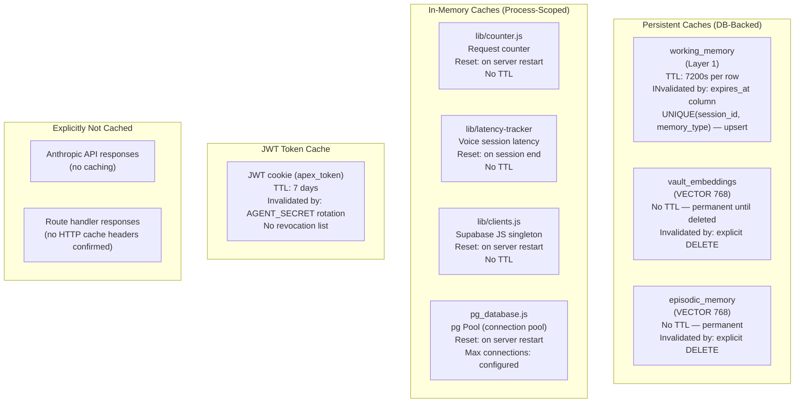

---

## DIAGRAM 13: PROBE ARCHITECTURE

**Description:** The 10-check governance probe in detail.

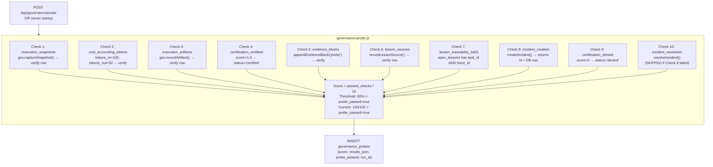

---

## DIAGRAM 14: VALIDATION ARCHITECTURE

**Description:** VALIDATOR stage behavior including fail-open gaps.

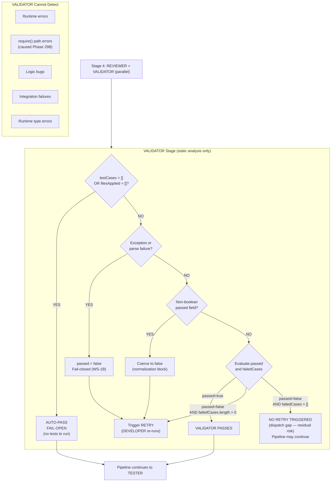

---

## DIAGRAM 15: AUDIT ARCHITECTURE

**Description:** How apex_agent_runs and apex_agent_stages capture every pipeline execution.

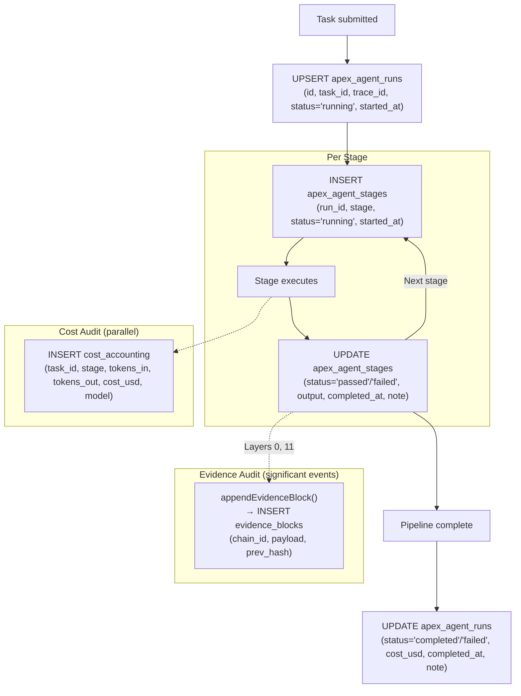

---

## DIAGRAM 16: EVIDENCE ARCHITECTURE

**Description:** Immutable evidence block chain structure.

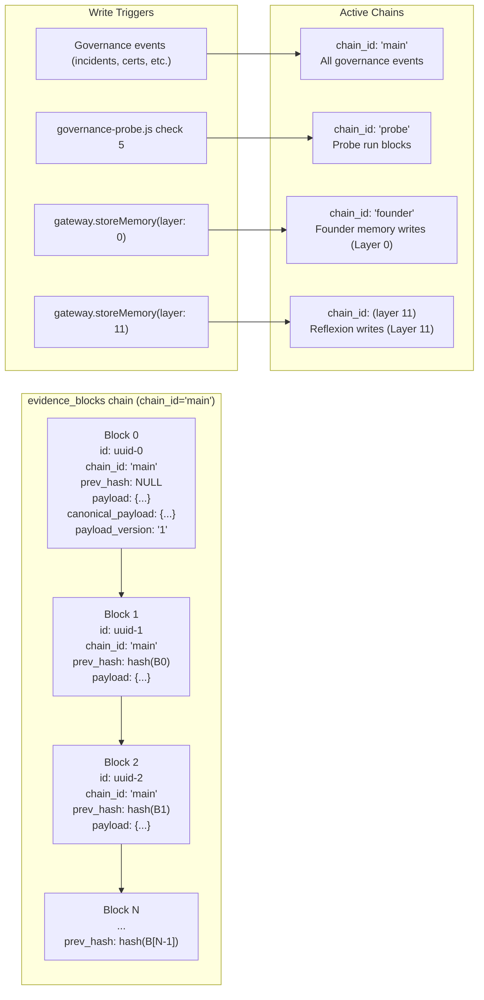

---

## DIAGRAM 17: BACKGROUND TASK ARCHITECTURE

**Description:** All timers, crons, and loops.

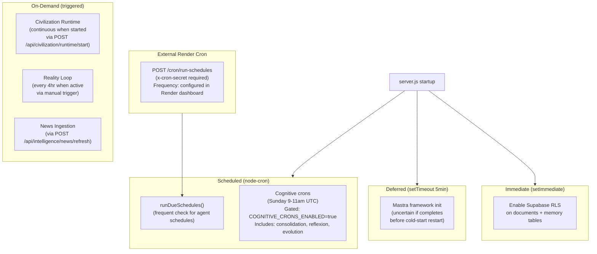

---

## DIAGRAM 18: EXTERNAL DEPENDENCY GRAPH

**Description:** APEX to all external services.

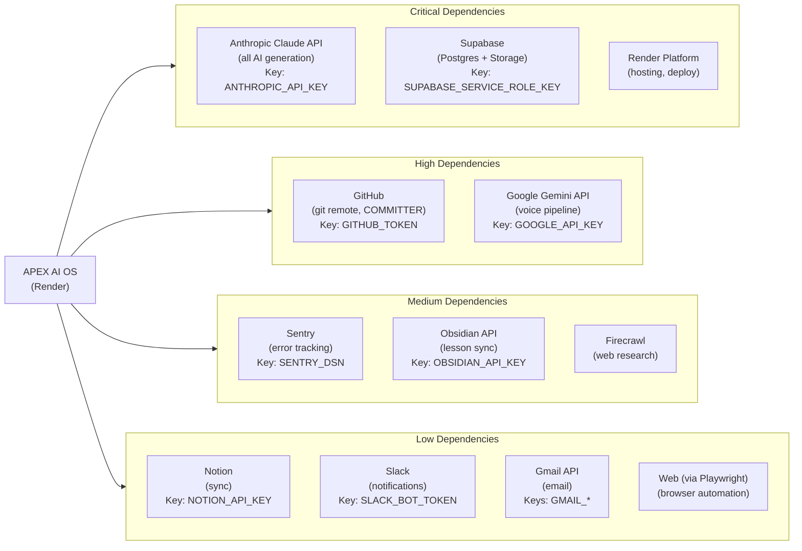

---

## DIAGRAM 19: INTERNAL MODULE DEPENDENCY GRAPH

**Description:** Key require() chains between internal modules.

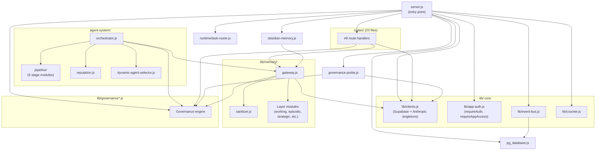

---

## DIAGRAM 20: END-TO-END DATA FLOW

**Description:** POST /api/chat from request to AI response, including memory injection.

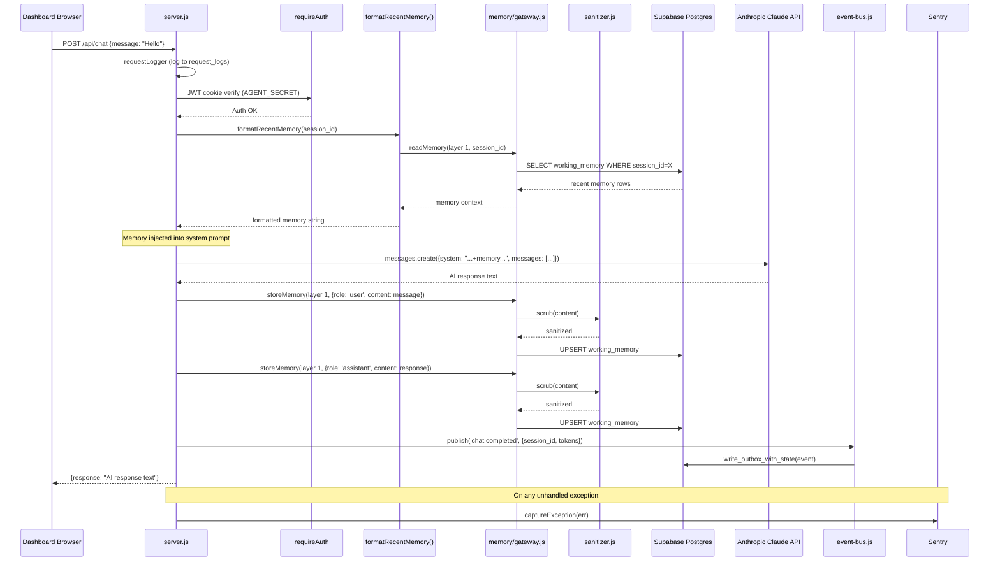
